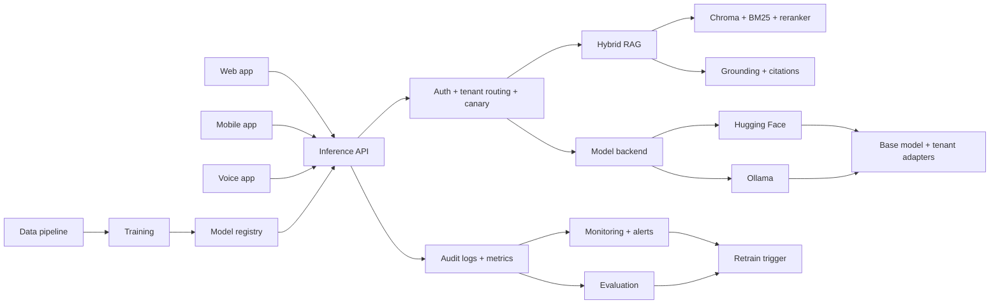

# Multi-Tenant LLM Platform with RAG

This repository is a full-stack, multi-tenant LLM platform built around one central FastAPI inference service.
It serves two isolated tenants today, `sis` and `mfg`, and combines hybrid RAG, tenant-specific adapters, evaluation, monitoring, and multiple client surfaces.
The rest of the documentation is intentionally split into a browsable `docs/` hub so a new engineer can understand the system top-down in GitHub.
Read this if you want the fastest possible orientation before diving into the detailed docs pages.

## System Map

## Start Here

| Read | Why |
| --- | --- |
| [docs/README.md](docs/README.md) | Entry point for the full documentation hub |
| [docs/architecture.md](docs/architecture.md) | One-page explanation of how the platform fits together |
| [docs/flows.md](docs/flows.md) | Main request, data, training, quality, and voice flows |
| [docs/repo-map.md](docs/repo-map.md) | Where code and generated artifacts live |

## Quick Start

| Goal | Command |
| --- | --- |
| Build tenant data | `make data` |
| Build RAG indexes | `make index` |
| Start inference API | `make serve` |
| Start monitoring | `make monitor` |
| Start web UI | `make web` |
| Run evaluation suite | `make eval` |
| Submit the CI-style HF Jobs suite | `make hf-jobs-ci` |

Training outputs are saved locally in this project by default, mainly under `models/`, `evaluation/reports/`, and `mlruns/`.

## Evaluation Reality Check

The platform itself is already built and operational even when the first golden-set run looks poor.
The most important context is that the golden set is not just checking whether the model responds fluently; it heavily rewards domain-specific required elements and terminology.
If you evaluate the unfine-tuned base path first, low scores, including `0%` in the worst case, are expected because the shared base model has not yet been adapted to SIS or MFG language.

| Situation | What it means |
| --- | --- |
| Golden set is near `0%` on the base model | Expected baseline behavior for an unfine-tuned general/base path under a keyword-heavy domain rubric |
| `make train` improves scores | Expected, because `make train` produces tenant-specific SFT adapters for `sis` and `mfg` |
| DPO improves behavior further | Expected, because DPO is the alignment step on top of SFT, not the first domain-learning step |

The repo’s current training configuration is centered on `Qwen/Qwen2.5-1.5B-Instruct`, and the Ollama fallback defaults to a plain `qwen2.5:1.5b` route unless tenant-specific models are registered.
Neither of those unfine-tuned base routes should be expected to naturally use SIS/MFG policy language before training.
After running `make train`, golden-set scores should move materially upward as the SFT adapters inject domain vocabulary and task patterns; the intended post-SFT range for this project is roughly `60-80%+`, with DPO then improving preference alignment and refusal behavior.

This gap is a success condition for the platform design, not evidence that the platform is incomplete.
The evaluation delta between the base model and the trained tenant adapters is exactly the gap the SFT and DPO pipeline is meant to close.

## Project Surfaces

| Surface | Entry point | Notes |
| --- | --- | --- |
| Inference API | `inference/app.py` | Central runtime for chat, streaming, feedback, stats, canary, and registry views |
| Web app | `web_app/src/app/page.tsx` | Next.js UI for chat, monitoring, and tenant comparison |
| Mobile app | `mobile_app/lib/main.dart` | Flutter client with chat and settings |
| Voice app | `voice_agent/voice_server.py` | HTTP + WebSocket voice flow with STT -> LLM -> TTS |
| Monitoring UI | `monitoring/dashboard.py` | FastAPI dashboard over audit, model, and system metrics |

## Supplemental Docs

These remain useful reference material, but they are not the main onboarding path:

- [AMD_GPU_SETUP.md](AMD_GPU_SETUP.md)
- [DEPLOYMENT_COMPLETE.md](DEPLOYMENT_COMPLETE.md)
- [docs/huggingface-jobs.md](docs/huggingface-jobs.md)
- [CODE_REVIEW.md](CODE_REVIEW.md)

## Next Pages To Read

- [docs/README.md](docs/README.md)
- [docs/architecture.md](docs/architecture.md)
- [docs/flows.md](docs/flows.md)
