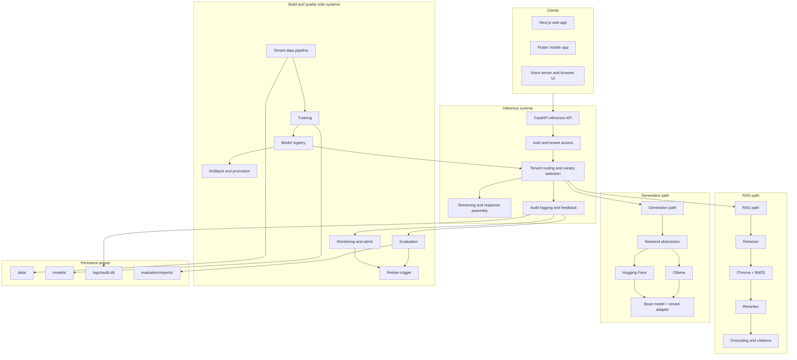

# Architecture

This page exists to give one stable, high-level picture of the platform.
It focuses on the major runtime paths, the major side systems, and the persistent artifacts that matter.
Read this if you want to understand how the pieces fit together before looking at implementation details.

## Core Ideas

- One FastAPI inference service is the center of the runtime.
- Two tenants exist today: `sis` and `mfg`.
- Tenant isolation is enforced through routing, prompts, RAG collections, adapters, and audit data.
- RAG is hybrid: vector retrieval, BM25, reranking, then grounding and citations.
- Model serving can run through Hugging Face adapters or Ollama-backed routing.
- Training, evaluation, monitoring, and MLOps surround the runtime rather than replacing it.
- Low golden-set scores on the unfine-tuned base route are expected and are part of the reason the SFT and DPO pipeline exists.

## Flagship System Diagram

## Tenant Lens

| Tenant | Domain | Main safety/compliance lens | Typical topic families |
| --- | --- | --- | --- |
| `sis` | Education / student information | FERPA, identity checks, student privacy | Enrollment, attendance, grading, transcripts, accommodations |
| `mfg` | Manufacturing / industrial operations | Safety, PPE, LOTO, quality control, incident handling | SOPs, CAPA, maintenance, compliance, defects |

## Runtime Building Blocks

| Layer | Primary responsibility | Important lower-level detail |
| --- | --- | --- |
| Client layer | Expose chat and monitoring surfaces | Web, mobile, and voice all converge on the same backend |
| Inference layer | Handle requests, routing, streaming, and logging | `inference/app.py` owns the public API surface |
| Tenant routing | Resolve tenant policy, RAG collection, and model variant | `base`, `sft`, and `dpo` are the relevant model variants |
| RAG | Retrieve and ground answers | Hybrid retrieval is the default mental model, not vector-only search |
| Generation | Produce final text tokens | Backends can switch between Hugging Face and Ollama |
| Quality loop | Observe, evaluate, alert, and recommend retraining | Monitoring and evaluation are separate but both feed decisions |

## Persistent Artifacts

| Artifact area | Purpose | Examples |
| --- | --- | --- |
| `data/` | Tenant documents, chunks, and training datasets | Raw docs, processed docs, chunks, SFT and DPO datasets |
| `models/` | Base model assets, adapters, merged outputs, registry | `models/base/`, `models/adapters/`, `models/registry.json` |
| `logs/` | Runtime audit and rollback records | `logs/audit.db`, `logs/rollbacks.jsonl` |
| `evaluation/reports/` | Pipeline, training, retraining, and eval reports | Consolidated eval and run summaries |

## Why Low Baseline Evaluation Is Not A Platform Failure

| Baseline observation | Architectural explanation |
| --- | --- |
| Golden set can score near `0%` before fine-tuning | The base model path is not yet tenant-adapted and the golden set expects SIS/MFG terminology and required elements |
| The system is still operational | Routing, RAG, monitoring, evaluation, and training infrastructure can all be working even while model quality is still at baseline |
| Training should change the score materially | The architecture is intentionally built so SFT adapters add domain language first, then DPO improves preference and refusal behavior |
| Quality gap validates the platform | A measurable base-to-adapter improvement is evidence that the training pipeline is serving its purpose |

## What To Ignore On First Pass

- Per-function training internals.
- Full endpoint payload schemas.
- Generated outputs under `data/`, `mlruns/`, and `evaluation/reports/`.
- Historical rollout notes unless you are debugging setup or deployment history.

## Next Pages To Read

- [flows.md](flows.md)
- [subsystems.md](subsystems.md)
- [repo-map.md](repo-map.md)
