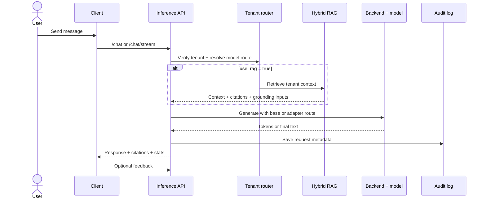
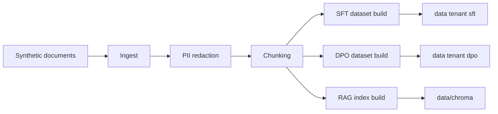
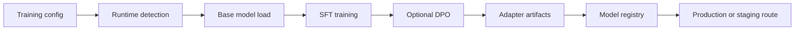
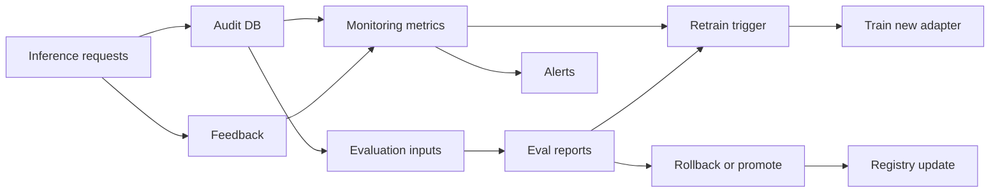
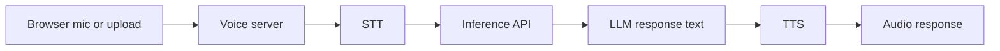

# Flows

This page exists to show the small, repeatable flows that make up the platform.
Each diagram is intentionally condensed so a new engineer can understand sequence and ownership quickly.
Read this if you already know the big picture and now want to trace how requests, data, and decisions move.

## Flow Index

| Flow | Why it matters |
| --- | --- |
| Chat request | Main product path through routing, RAG, generation, and logging |
| Data lifecycle | How tenant documents become retrieval and training assets |
| Training lifecycle | How adapters are produced and promoted |
| Quality loop | How the platform observes itself and decides when to retrain or roll back |
| Voice path | How speech input and output wrap the same inference runtime |

## Chat Request Flow

## Data Lifecycle

## Training Lifecycle

## Quality Loop

## Voice Path

## Notes That Matter

| Detail | Why it matters |
| --- | --- |
| RAG is optional per request | The chat path can run with or without retrieval |
| Routing happens before generation | Tenant policy and model selection are not post-processing steps |
| Training and evaluation are decoupled | New adapters can be evaluated and promoted independently |
| Voice is a wrapper, not a separate intelligence stack | It reuses the same tenant-aware inference path |

## Next Pages To Read

- [architecture.md](architecture.md)
- [operations.md](operations.md)
- [subsystems.md](subsystems.md)
